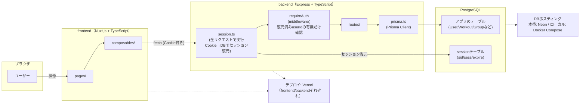
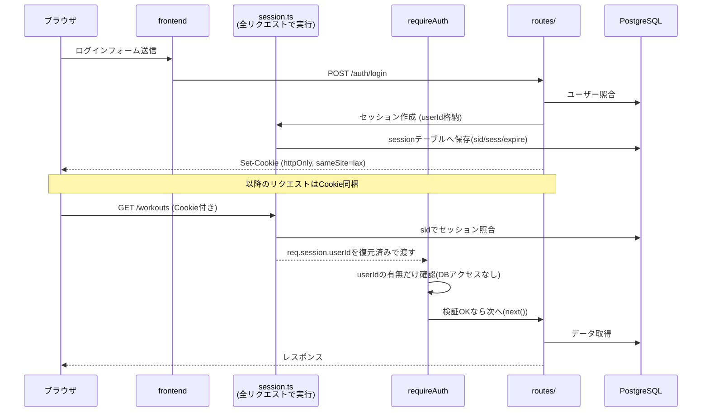

# アーキテクチャ概要

トレ部の技術構成の全体像。詳しい技術選定の理由は[プロジェクトのCLAUDE.md](../../CLAUDE.md)を参照。

具体的なコードの流れを読みたい場合は[backend-guide.md](./backend-guide.md) / [frontend-guide.md](./frontend-guide.md)へ。

## 全体構成

frontendの`composables/`からbackendへの矢印は、実際には`/api/**`へのリクエストがNuxtの`routeRules`でbackendのオリジンにプロキシされている(設定は[`frontend/nuxt.config.ts`](../../frontend/nuxt.config.ts))。フロント側のコードはbackendの実URLを直接知らない。

## 認証フロー（セッション方式）

JWTではなくセッション方式を採用している理由は[`docs/schema.md`](../schema.md)を参照。

`session.ts`のセッションミドルウェアは**全リクエストで自動的に**実行され、Cookieを元にDBから`req.session`を復元する。`requireAuth`はその後に実行され、復元済みの`req.session.userId`があるかどうかを見るだけで、そのタイミングで改めてDBに問い合わせることはない(詳細は[backend-guide.md](./backend-guide.md)参照)。

### 用語メモ

- **セッション** — サーバー側が「誰がログイン中か」を覚えておく仕組み。ブラウザにはランダムなID(`sid`)だけをCookieで持たせ、実際のユーザー情報はDBの`session`テーブル側に保存する(JWTのようにユーザー情報自体をクライアントに持たせる方式とは対照的)
- **Cookie / httpOnly / sameSite** — ブラウザがサーバーとの間でやり取りする小さなデータ。`httpOnly`はJavaScriptから読み取れないようにする設定(XSS対策)、`sameSite=lax`は他サイトからの不正リクエストを防ぐ設定(CSRF対策の一部)。実装は[`backend/src/session.ts`](../../backend/src/session.ts)
- **ミドルウェア** — リクエストがルートハンドラーに到達する前に挟まる共通処理。トレ部では役割の異なる2段階がある：①`session.ts`(全リクエストで実行、Cookie→DBでセッション復元) → ②`requireAuth`(復元済みの値があるかを見るだけ、DBには触らない)

## デプロイ構成

- frontend・backendはそれぞれ独立してVercelにデプロイ
- 本番DBはNeon(PostgreSQLのマネージドホスティング)、ローカル開発はDocker Compose
- backendはVercelのサーバーレス関数として動くため、`app.listen()`はローカル/テスト時のみ実行される([`backend/src/index.ts`](../../backend/src/index.ts)参照)
